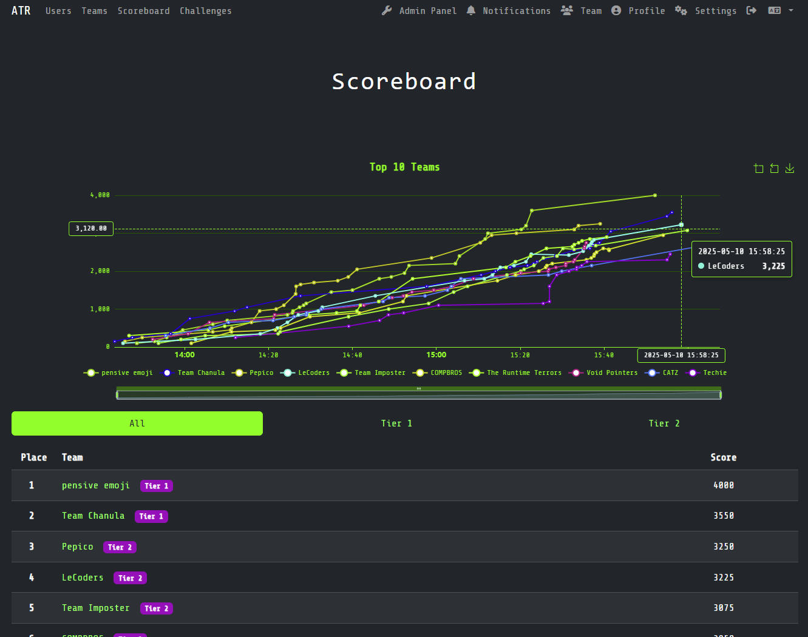
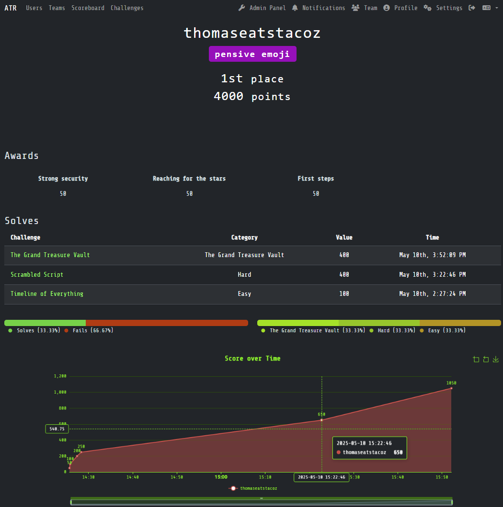
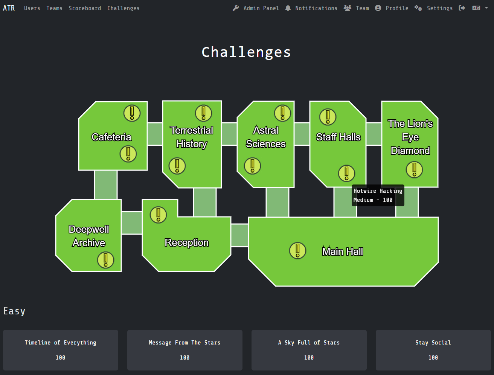
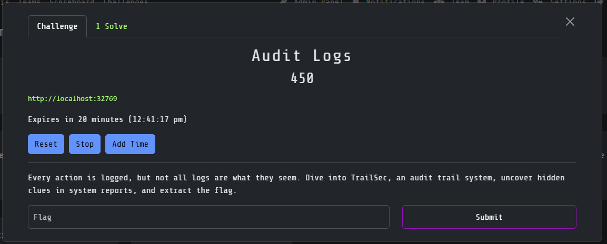
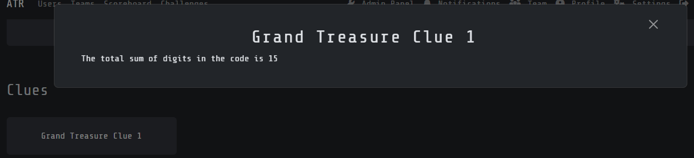
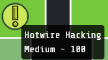
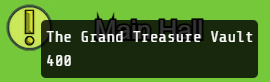

# atr25-theme

Fork of CTFd's core-beta theme for custom dark mode theme. Used in ComSSA's 2025 ATR event.

Refer to [CTFd/core-beta](https://github.com/CTFd/core-beta) and consider pulling from there for updates.

## Screenshots

Scoreboard



User Profile



Challenge List and Map



Challenge Modal



## Subtree Installation

### Add repo to themes folder

```
git subtree add --prefix CTFd/themes/atr25-theme git@github.com:ComSSA/atr25-theme.git main --squash
```

### Pull latest changes to subtree
```
git subtree pull --prefix CTFd/themes/atr25-theme git@github.com:ComSSA/atr25-theme.git main --squash
```

### Subtree Gotcha

Make sure to use Merge Commits when dealing with the subtree here. For some reason Github's squash and commit uses the wrong line ending which causes issues with the subtree script: https://stackoverflow.com/a/47190256. 

## Clues

There is a custom Category added with the theme for "Clues". Any challenge with this category is intended to have a requirement of a different challenge solve. They should have no flag and were hints for a [final challenge](https://github.com/s3ansh33p/atr25_challenge). Feel free to find/replace the "Clues" category with your own in the `challenge.html` and `challenges.html` template files.



The following Theme Settings were used in the admin panel for the 2025 ATR event:
```js
{
  "challenge_window_size": "xl",
  "challenge_category_order": "function compare(a, b) {\r\n  const order = [\"EASY\", \"MEDIUM\", \"HARD\", \"CLUES\", \"THE GRAND TREASURE VAULT\"];\r\n  return order.indexOf(a.toUpperCase()) - order.indexOf(b.toUpperCase());\r\n}",
  "challenge_order": "",
  "use_builtin_code_highlighter": true
}
```

## Map

This theme includes a map of an event venue with challenges that have physical locations shown with a task icon. It is themed around the game Among Us. Task icons can be hovered to show a tooltip with the challenge name, category and points, and clicking on the icon will open the relevant challenge modal.

Requires https://github.com/s3ansh33p/ctfd-event-countdown to be installed in plugins

There is a custom [map.svg](assets/img/map.svg) file. This can be changed, along with the following:
```js
// assets/js/challenges.js#L290
...
class MapManager {
  constructor(challenges) {
    this.challenges = challenges;
    this.icons = [];
    this.registerMouseOverHook();
    this.width = 1020; // set to width of svg
    this.height = 496; // set to height of svg
    this.render();
  }
...
```

Room labels for the map are drawn on a canvas and managed by `templateTexts`. In the admin panel, you can inject a script tag with a global variable `serverTexts` to override the default texts which can be useful mid-event.
```js
// Theme Header in admin panel, for example adding a room number below the name
<script>
  window["serverTexts"] = [
      { text: "Main Hall|301", x: 764, y: 404 },
    ];
</script>
```
To add a newline, use the pipe character `|` in the text, e.g. "Main Hall|301" will render as follows and be centered around the coordinates:
```
Main Hall
   301
```

```js
// assets/js/challenges.js#L323
...
  async renderRoomText() {
    const templateTexts = [
      { text: "Main Hall", x: 764, y: 404 },
      { text: "Reception", x: 350, y: 380 },
      { text: "Deepwell|Archive", x: 90, y: 363 },
      { text: "Cafeteria", x: 150, y: 100 },
      { text: "Terrestrial|History", x: 363, y: 100 },
      { text: "Astral|Sciences", x: 560, y: 100 },
      { text: "Staff Halls", x: 753, y: 100 },
      { text: "The Lion's|Eye|Diamond", x: 944, y: 100 },
    ];
    let texts = templateTexts;
    if (window["serverTexts"]) {
      // For manual overrides if needed during an event, loading from the injected header
      texts = window["serverTexts"];
    }
...
```

Challenges in the admin panel can have tags added as follows. Note that as icons are drawn on a canvas, the canvas will be responsive/scale by the parent container and the `x` and `y` coordinates will be relative to the svg dimensions (e.g. x from 0-1020).
- `x:int` - x coordinate on canvas
- `y:int` - y coordinate on canvas
- `c:0` - if set, hide category in tooltip

### Showing category
Default behaviour, e.g. tags on this challenge are `x:750` and `y:170`



### Hiding category
e.g. tags on this challenge are `x:620`, `y:375`, and `c:0`


